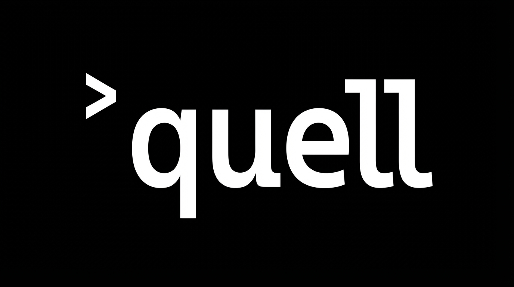
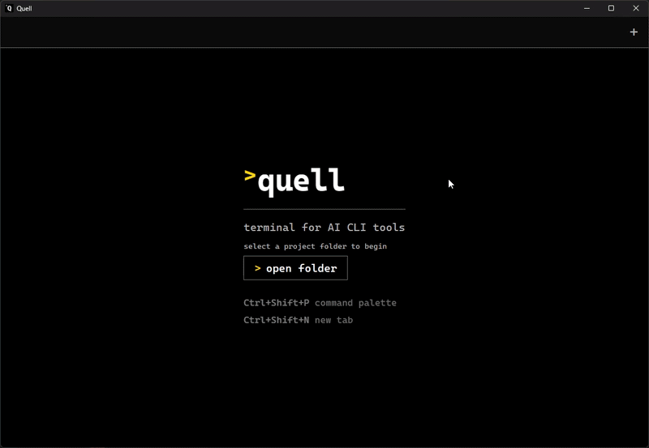
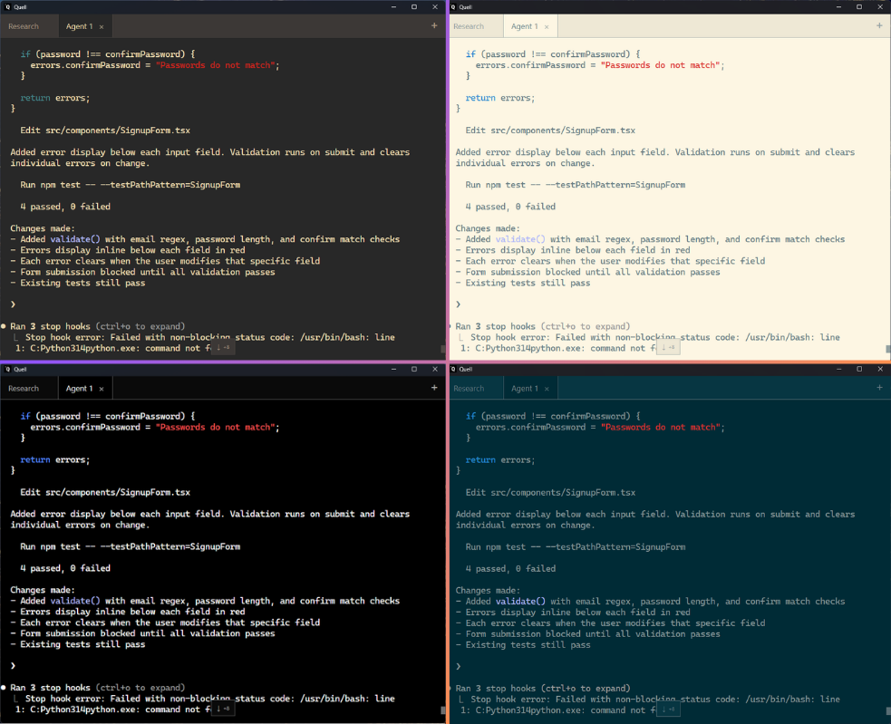

# > Quell

[](https://github.com/FurbySoup/quell/actions/workflows/ci.yml)
[](LICENSE)
[](https://github.com/FurbySoup/quell/releases)
[](https://www.rust-lang.org/)

**The terminal that makes Claude Code usable on Windows.**

Quell is a standalone terminal built for AI CLI tools. It eliminates the scroll-jumping that makes Claude Code, Copilot CLI, and Gemini CLI unusable in standard terminals — and adds search, themes, tabs, and a command palette on top.



## The Problem

Every AI CLI tool streams output through VT escape sequences. Windows terminals reset the scroll position on every update, causing constant scroll-jumping during long responses. This is the [#1 complaint](https://github.com/anthropics/claude-code/issues/1208) across AI CLI tools, with hundreds of upvotes across multiple issue trackers.



## Two Products, One Engine

| | **Quell GUI** | **Quell CLI** |
|---|---|---|
| **What** | Standalone terminal application | Lightweight terminal proxy |
| **For** | Everyone | Power users |
| **Install** | Installer (.exe) | Portable binary |
| **How** | Open → pick folder → go | `quell claude` in any terminal |
| **Features** | Tabs, themes, search, palette, zoom | Scroll stability, security filtering |

Both share the same Rust engine — the same ConPTY proxy, VT processing pipeline, and security filtering.

## GUI Features

### Themes

14 built-in themes with full terminal + chrome coordination. Switch instantly via the command palette — color swatches show each theme's palette at a glance, and live preview lets you see every theme before committing.



Quell Dark · Quell Light · High Contrast · Solarized Dark/Light · Monokai · Nord · Dracula · Tokyo Night · Catppuccin Mocha · Gruvbox Dark · One Dark · Rosé Pine · CVD-Friendly

### Search

`Ctrl+Shift+F` — find text in the terminal buffer with regex, case-sensitive, and whole-word options. Match highlighting adapts to the active theme. Navigate matches with `F3` / `Shift+F3`.


### Command Palette

`Ctrl+Shift+P` — fuzzy search over every action. Switch themes with live preview, open tabs, adjust zoom, toggle search — all from the keyboard. Active settings are marked with visual indicators so you always know the current state.


### Tabs

Multiple sessions in one window. Each tab is an independent terminal session. `Ctrl+Tab` to cycle, `Ctrl+1-9` to jump directly, double-click to rename.

### Zoom

`Ctrl+=` / `Ctrl+-` / `Ctrl+0` — font size adjusts across the entire UI (terminal, tabs, search bar, palette). Persisted across restarts.

### Project Folder Picker

On launch, choose your project folder. New tabs inherit the directory. Switch projects via the palette with "New Tab (Choose Folder)".

### Security

AI-generated output is untrusted. Quell classifies every VT escape sequence:

| Category | Action | Examples |
|----------|--------|----------|
| **Blocked** | Stripped entirely | Clipboard access (OSC 52), font queries, terminal device queries |
| **Filtered** | Sanitized | Window titles (control chars stripped), hyperlinks (http/https only) |
| **Validated** | Sanitized at trust boundary | Spawn arguments (flags only), working directory (local paths only) |
| **Allowed** | Passed through | Cursor movement, colors, screen management, sync markers |

Content Security Policy enabled. No `eval()`, no inline scripts. Spawn parameters are validated at the Rust trust boundary — the frontend cannot inject arbitrary commands or network paths.

See [SECURITY.md](SECURITY.md) for the full threat model.

## Quick Start — GUI

### Install

1. Download `Quell-x64-setup.exe` from [Releases](https://github.com/FurbySoup/quell/releases)
2. Run the installer (no admin required — installs to your user profile)
3. Launch Quell from the Start menu or desktop shortcut
4. Pick your project folder → Claude Code starts

### Requirements

- **Windows 10 21H2+** or **Windows 11** (WebView2 runtime — ships with modern Windows, installer downloads it if missing)
- An AI CLI tool installed ([Claude Code](https://docs.anthropic.com/en/docs/claude-code), Copilot CLI, Gemini CLI, etc.)

## Quick Start — CLI Proxy

For power users who want scroll stability in their existing terminal without switching to a new app.

### Install

1. Download `quell-cli-x64.exe` from [Releases](https://github.com/FurbySoup/quell/releases)
2. Rename to `quell.exe` and place in a folder on your PATH
3. Run:

```bash
quell claude
```

### Usage

```bash
quell claude                    # Run Claude Code through quell
quell gemini                    # Any AI CLI tool works
quell --tool claude my-wrapper  # Explicit tool override
quell --verbose claude          # Debug output
```

### Requirements

- **Windows 10 1809+** (ConPTY support)
- **Windows Terminal 1.25+** for Shift+Enter support (older terminals still work)

## Keyboard Shortcuts

| Shortcut | Action |
|----------|--------|
| `Ctrl+Shift+P` | Command palette |
| `Ctrl+Shift+F` | Search in terminal |
| `Ctrl+Shift+N` | New tab (same folder) |
| `Ctrl+Tab` / `Ctrl+Shift+Tab` | Cycle tabs |
| `Ctrl+1-9` | Jump to tab |
| `Ctrl+=` / `Ctrl+-` / `Ctrl+0` | Zoom in / out / reset |
| `F3` / `Shift+F3` | Next / previous search match |
| `Ctrl+C` | Copy (with selection) / SIGINT (without) |
| `Ctrl+V` | Paste |
| `Ctrl+Shift+C` / `Ctrl+Shift+V` | Alternative copy / paste |

## Configuration

The CLI proxy accepts optional configuration in `%APPDATA%\quell\config.toml`:

```toml
render_delay_ms = 5
sync_delay_ms = 50
history_lines = 100000
log_level = "info"
```

The GUI app persists preferences (font size, theme) automatically. CLI flags override config file values — see `quell --help`.

**Passing flags to AI tools:** The GUI validates extra arguments for security. Flags must use `=` for values (e.g. `--model=sonnet`), not spaces.

## Building from Source

Requires [Rust](https://rustup.rs/) (stable toolchain) and [Node.js](https://nodejs.org/) 18+ (for the GUI).

```bash
git clone https://github.com/FurbySoup/quell.git
cd quell

# CLI proxy only
cargo build --release -p quell-cli
# Binary at target/release/quell.exe

# GUI app
cd gui/src-frontend && npm install && cd ../src-tauri
cargo tauri build
# Installer at target/release/bundle/nsis/
```

## Known Limitations

- **Resize during streaming** may cause brief visual artifacts from ConPTY's cursor-positioned redraw ([microsoft/terminal#14774](https://github.com/microsoft/terminal/issues/14774)). Content is not lost — artifacts clear on next output.
- **Emoji picker (Win+.)** and **IME input** may not work through the proxy layer. Workaround: paste via `Ctrl+V`.
- **Theme colors for child process output** — AI tools like Claude Code set their own ANSI colors, which override the terminal theme's palette for their UI elements. The terminal background, chrome, and default text colors always reflect the selected theme.
- **Windows Voice Typing (Win+H)** works for short phrases but truncates long continuous sentences. Speak in natural shorter phrases for reliable results. Full voice input support is planned for a future release.

## Roadmap

- **Phase 1: CLI proxy** — shipped, public
- **Phase 2: GUI terminal** — tabs, copy/paste, session management, architecture hardening
- **Phase 3.0: First public release** — search, 14 themes with live preview, command palette with swatches and category grouping, security hardening, folder picker *(complete)*
- **Phase 3.1:** Block-based output, session persistence
- **Phase 3.2:** Split panes, polish
- **Phase 3.3:** Community release — auto-update, installer, push guard removal
- **Phase 4:** Plugin marketplace

## License

[MIT](LICENSE)
